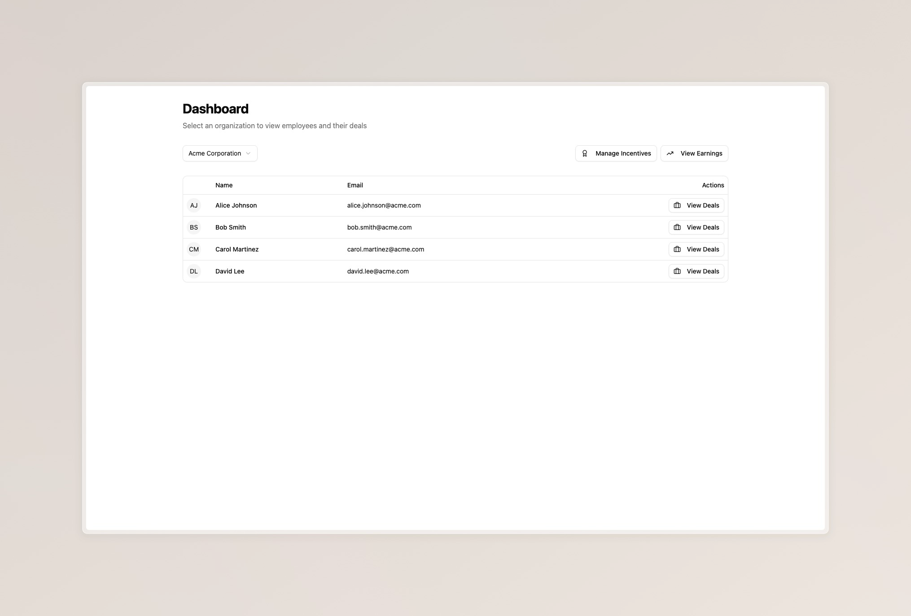
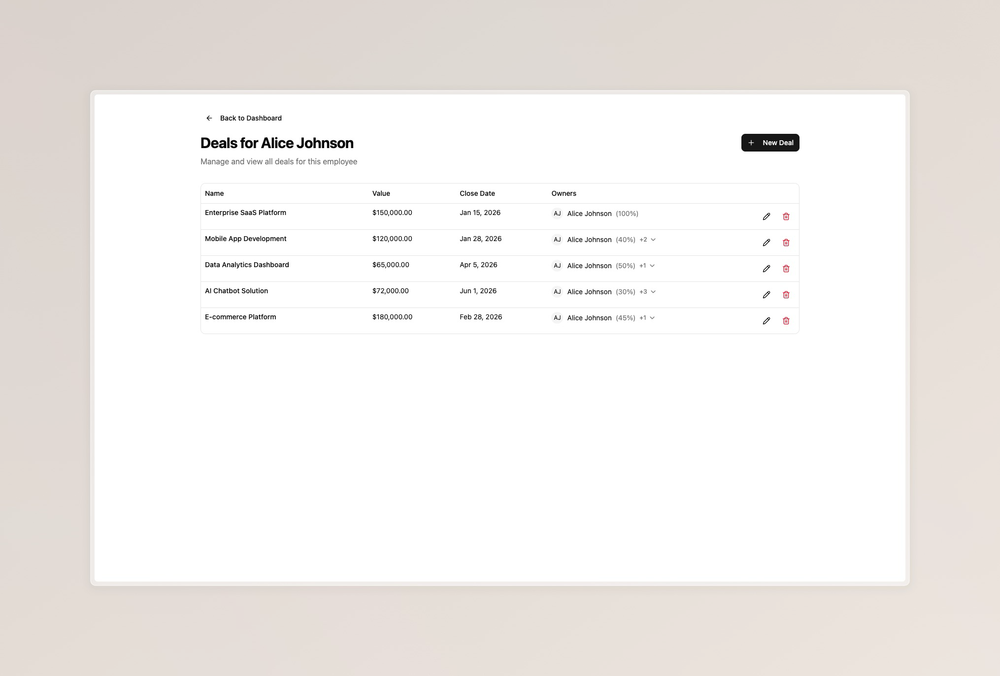
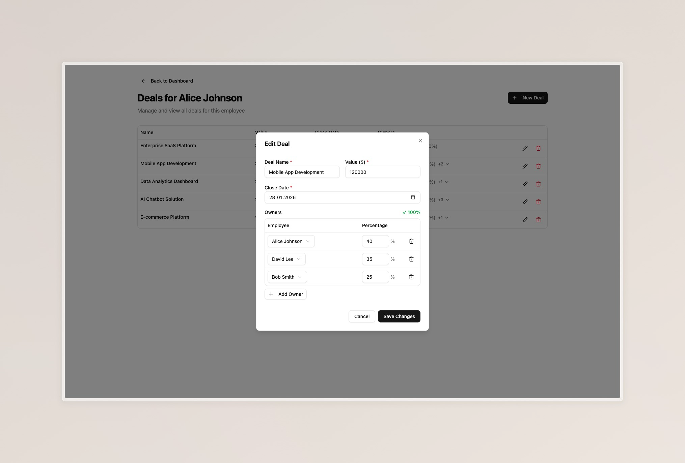
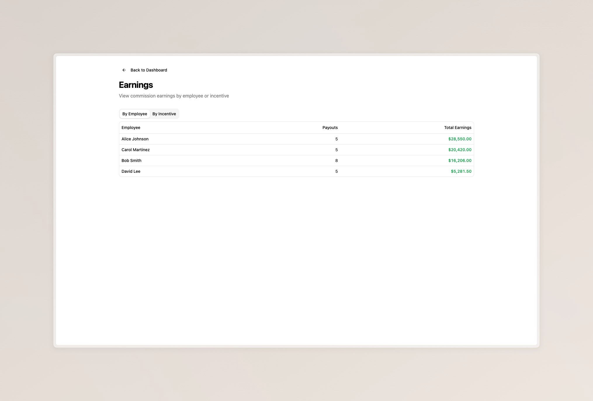
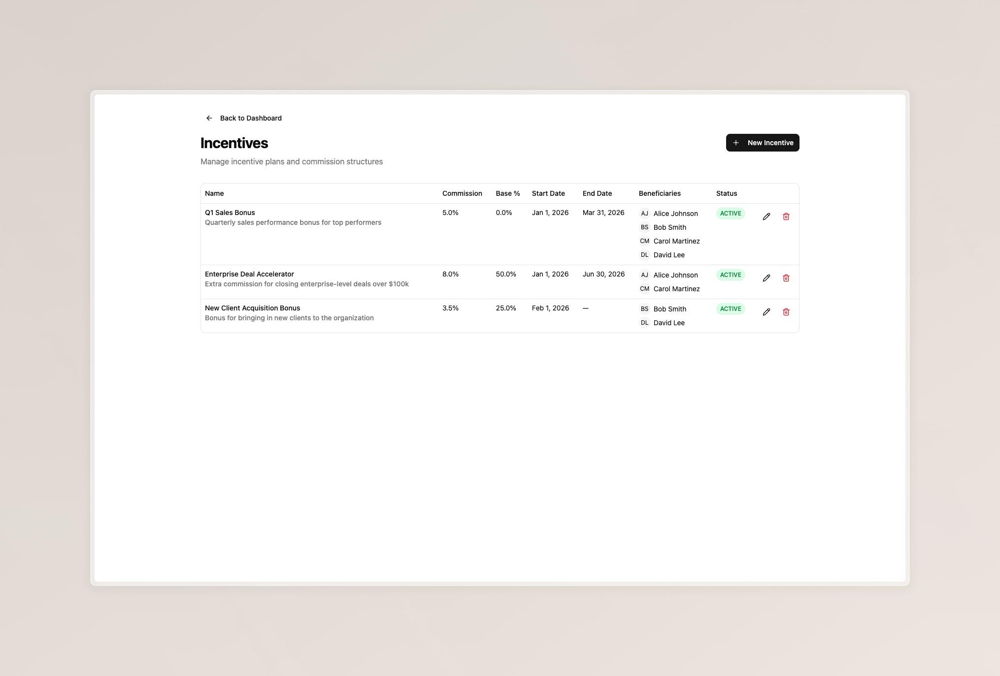
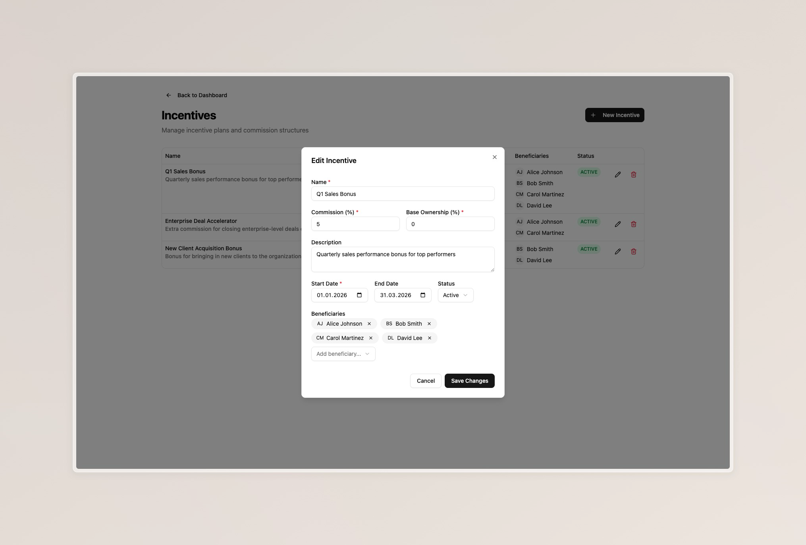

# Code challenge overview

## Generative AI Disclaimer

Generative AI (Claude Code Opus) has been used to aid with

- Unit test generation
- Autocompletion during UI component development
- Seed data generation for database seeding

## Architecture

The structure remained the same with a `backend` and `frontend` folder. A new `shared` folder has been created, which now hosts the contracts between frontend.

The project now utilises `ts-rest` to enable fully typesafe communication between frontend and backend. All data is validated using `zod`.
`ts-rest` is also being used to register routes and data handlers.

I have opted for `vite` as the build tool in both `frontend` and `backend`.

All the expected technology has been used, even though I am unfamiliar with some of the chosen technologies. I hope to highlight my willingness and ability to work with unknown technologies and frameworks with this choice.

### Code structure

#### Backend

`index.ts`  
Contains the basic express configuration

`/prisma/`  
Contains the prisma schema, migrations and seeding scripts

`/src/prisma.ts`  
Contains the prisma connection

`/src/routes/`  
Contains the data resolvers for CRUD operations and earnings calculation

#### Frontend

`/src/components/`  
Contains shadcn components as well as custom components that can be reused

`/src/pages/`  
Contains the logic for the pages available in the frontend application

## Divergences to the acceptance criteria

The UI structure has been altered slightly, such that a dashboard is loaded on the landing page where the user can select an organisation, sees the employees of that organisation and can open their deals and earnings reports from there. This choice has been made in favor of better usability. This does not impact the scope of the functionality.

## Testing instructions

To locally start the full application in production mode, in the root folder use

```shell
docker-compose up --build
```

This builds containers for both the `backend` and `frontend` components, as well as initializes a PostgreSQL container.

The docker compose is zero configuration and does not need to be updated.
The docker container automatically seeds its database

## Preview













## Challenges

### Time

The biggest challenge by far were time constraints.

Even though I kept typing all the time (making The Primeagen proud with my VIM skills) and used generative AI to speed up UI component and unit test development, just checking documentation from time to time and taking only one restroom break, I was unable to complete the assigned task in under 6 hours.

Given the amount of code I have produced, I do not believe it is possible to complete the assignment in the expected time and create an acceptable result.

### UUID issues

Utilizing both ZOD and Prisma, I quickly realized that the automatically generated UUIDs by Prisma did not pass the ZOD schema validation.

This issue cost some time to debug and find a solution for, even though the solution turned out to be quite simple - I just generated the IDs myself.

### Prisma issues

Following the Prisma documentation for the initial setup, I encountered an issue where the database was unreachable.

It turned out that the dotenv import was missing, which is a super easy fix, but being unfamiliar with Prisma this issue cost me some time.

### Ambiguous acceptance criteria

Even though the acceptance criteria was clear in hindsight, during implementation I had to iterate on multiple criteria, because they were not clear to me during the first read through.
